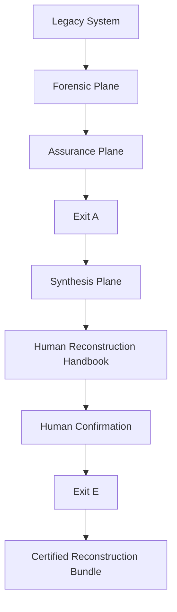

# Legacy Autopsy

> **Project status — M0 foundation**
>
> The repository can validate protocol/skill routing, create and inspect an empty `.extracted/` skeleton, generate foundational IDs, assemble bounded context packets, and run bootstrap fixtures. It does **not** yet execute semantic deconstruction modes, prove Exit A or Exit E, or claim Protocol v4 conformance.

> **Normative authority**
>
> [`protocol.md`](protocol.md) is normative. All skills, schemas, tools, docs, examples, and validators are non-authoritative implementations or projections. If they conflict, `protocol.md` wins.

## Try Protocol v4 on your legacy repository

> [!IMPORTANT]
> **The fastest way to try Legacy Autopsy today is to give the normative protocol directly to your own coding agent.** This is a manual, agent-driven trial—not full M0 harness execution or proof of Protocol v4 conformance.

Work on a clean branch in an approved, non-production copy of the legacy repository. Copy `protocol.md` into that repository's root:

```sh
cp /path/to/legacy-autopsy/protocol.md /path/to/your-legacy-repository/protocol.md
```

Open the legacy repository with your agent and give it this instruction:

```text
Read ./protocol.md completely and treat it as normative. Execute the Legacy System
Deconstruction, Assurance, and Reconstruction Protocol strictly, beginning with
Preflight. Before writing, establish the required Section 8.1 invocation identity,
exact scope and snapshots, and allowed and forbidden read/write targets. Follow every
MUST and MUST NOT requirement, evidence rule, ownership boundary, checkpoint, stop
condition, and gate. Do not guess, fabricate evidence, access production, mutate the
legacy source, or claim Exit A, Exit E, or Protocol v4 conformance unless the protocol's
requirements are actually satisfied. Ask me for missing scope, access, snapshot, and
human decisions, and stop whenever the protocol requires human action.
```

The protocol does not authorize production access. Keep credentials, raw exports, probe output, production data, and private operator material outside the repository and agent-visible context.

This manual trial intentionally gives the agent the complete protocol. The developing orchestration service will instead assemble bounded, mode-specific normative context so each executor invocation receives only its authorized scope.

For reproducible trials, record the Legacy Autopsy commit or protocol version used with the resulting `.extracted/` workspace.

## Current state at a glance

Legacy Autopsy currently has **two different maturity levels**:

- **Protocol maturity:** `protocol.md` is the complete normative specification currently used by this project.
- **Runtime maturity:** the repository's deterministic automation currently implements only the **M0 foundation** of that protocol; the local service and workbench are target architecture, not current capability.

### What you can do today

- use `protocol.md` directly with your own coding agent in a manual deconstruction workflow;
- validate protocol/skill routing;
- initialize and inspect an empty `.extracted/` workspace;
- generate foundational IDs;
- assemble bounded context packets;
- run bootstrap fixtures.

### What is not automated yet

The repository does **not yet automate** large parts of the protocol, including:

- semantic execution of deconstruction modes;
- ticketing, reconciliation, and coverage closure;
- Exit A and Exit E validation;
- synthesis, confirmations, handbook generation, and packaging;
- full Protocol v4 conformance checking.

### What this means

The **protocol itself is already present and usable**. What is still incomplete is the deterministic runtime and automation that will orchestrate, execute, validate, and present it.

## What Legacy Autopsy is

Legacy Autopsy is evolving into a **local-first interactive autopsy workbench and orchestration service** where humans and executors collaboratively build an evidence-backed model of a legacy system. The protocol governs truth, state, assurance, and reconstruction readiness.

> **Legacy Autopsy owns orchestration and protocol state. Executors own semantic work.**

The target service manages multiple isolated autopsies, schedules bounded invocations, validates and commits workspace transactions, projects an explorable Atlas, and keeps human questions available asynchronously. User-facing execution arrives in order: first the generic skill inside any compatible coding harness, then thin managed adapters for named harnesses, and finally a minimal internal direct-model runner. During the first stage, the UI and CLI cannot manually start semantic work. The current M0 repository does not yet implement that service or UI; see the [runtime design](docs/runtime.md) and [architecture](docs/architecture.md).

The complete protocol pipeline is:



This diagram describes Protocol v4, not current M0 implementation coverage. Exit A and Exit E are protocol gates that only their required deterministic artifacts and validations can establish.

## Design principles

- **Normative law stays singular:** `protocol.md` defines behavior; secondary material routes to or implements it.
- **Orchestration and semantics stay separate:** Legacy Autopsy owns protocol/runtime state and deterministic commits; interchangeable executors perform bounded semantic work.
- **Reasoning and mechanics stay separate:** LLMs interpret evidence and semantics; code handles identity, parsing, scope, ordering, hashing, validation, and state transitions.
- **Filesystem state survives sessions:** `.extracted/` is persistent execution state; conversation memory is disposable.
- **Evidence is not inference:** model reasoning cannot promote itself into source evidence.
- **Projections are not authority:** generated sidecars and human-facing views remain traceable derivatives.
- **Trust boundaries fail closed:** raw acquisition material, credentials, probes, and operator-private state stay outside agent-visible repository content.

Legacy Autopsy is not a generic code summarizer, automatic rewrite tool, modernization-architecture generator, or system that treats LLM inference as evidence. It does not authorize production access or mutation.

## Getting started

Go 1.24 or newer is required. From the repository root:

```sh
go run ./cmd/legacy-autopsy doctor
go run ./cmd/legacy-autopsy protocol check
go run ./cmd/legacy-autopsy init --workspace /tmp/legacy-autopsy-example/.extracted
go run ./cmd/legacy-autopsy workspace check --workspace /tmp/legacy-autopsy-example/.extracted
```

This creates only an initialization scaffold; it invents no source facts, evidence, coverage, confirmation, or gate result. Continue with the [minimal example](examples/minimal/README.md), or see [development.md](docs/development.md) for IDs, context packets, validators, fixtures, and contributor checks.

## M0 implementation maturity

Implemented bootstrap capabilities:

- a thin skill/router with exactly 13 mode projections and machine-validated routing metadata;
- a provider-neutral Go CLI: `doctor`, `init`, `protocol check`, `workspace check`, `id`, `context`, and implemented `validate` targets;
- a small structural Markdown model for headings, fields, code blocks, comments, tables, and bounded sections;
- foundational typed IDs, normalized SRC-FILE paths, relative-path validation, and an explicitly limited basic Markdown hash primitive;
- atomic creation and structural checking of a non-fabricated four-plane workspace skeleton;
- workspace-confined context packets containing exact routed protocol sections and loaded workspace inputs;
- unit tests, positive/negative bootstrap fixtures with stable diagnostics, and CI.

Explicitly unsupported or deferred:

- semantic execution of all 13 invocation modes, mutation authorization, automatic transitive read closure, stale-check enforcement, and `0G` transaction handling;
- complete canonicalization, schema/enum coverage, collision extension, specialized PRF/HBK/COV/CND identity, record/envelope/package hashing, and every complete Part 19.2 family;
- claims, source/frontier semantics, tickets, probes, reconciliation, coverage arithmetic, acquisition execution, synthesis, confirmations, handbook generation, packaging, Exit A, and Exit E;
- full Protocol v4 conformance and a real-system dry run.

Routing support is not mode-execution support. Bootstrap fixtures test only registered M0 primitives and do not satisfy a complete Part 19.2 family.

## Repository guide

**First-time users**

- [Minimal example](examples/minimal/README.md): shortest implemented flow.
- [Workspace guide](docs/workspace.md): the four planes and initialization boundary.
- [Development guide](docs/development.md): full CLI and local checks.

**Agents and contributors**

- [AGENTS.md](AGENTS.md): protocol-integrity and contribution rules.
- [Skill entry point](skill/SKILL.md) and [skill guide](skill/README.md): non-authoritative invocation routing.
- [Architecture](docs/architecture.md): current M0 packages and target service boundaries.
- [Runtime and workbench](docs/runtime.md): multi-autopsy orchestration, executors, Atlas, questions, and UI target design.
- [Conformance](docs/conformance.md) and [fixture corpus](fixtures/README.md): implemented cases versus normative completeness.
- [Roadmap](docs/roadmap.md): staged M0–M16 delivery.
- [Schema projections](schemas/README.md): current schema status and future boundary.
- [Export-helper boundary](tools/export-helper/README.md): operator-only acquisition trust model.

## License

MIT. See [LICENSE](LICENSE).
