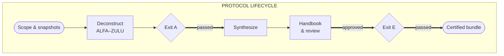
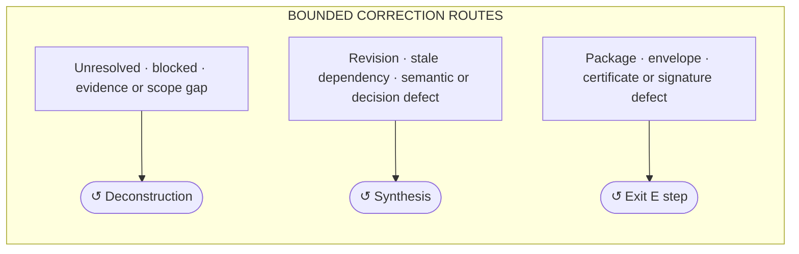

# Legacy Autopsy

Legacy Autopsy is a **local-first reference/tooling implementation** for evidence-backed deconstruction and reconstruction of legacy systems. It helps humans and coding agents build a persistent, reviewable model of a system instead of relying on one-shot summaries or conversation memory.

The project is built around [`protocol.md`](protocol.md), a standalone specification that can be used directly with any capable coding agent. Legacy Autopsy adds orchestration, deterministic validation, persistent workspace management, and—over time—an interactive workbench.

> **Project status — M0 foundation**
>
> The protocol is available and usable today. The Legacy Autopsy tooling currently implements only its M0 foundations: protocol/skill routing, an empty `.extracted/` workspace skeleton, foundational IDs, bounded context packets, and bootstrap fixtures. It does **not** yet execute semantic deconstruction modes, prove Exit A or Exit E, or claim Protocol v4 conformance.

> **Normative authority**
>
> `protocol.md` is implementation-independent and the sole normative authority. Legacy Autopsy is one non-authoritative implementation that operationalizes it. The protocol does not require this repository, its service, CLI, UI, Atlas, skills, fixtures, or validators. If any implementation or projection conflicts with `protocol.md`, the protocol wins.

## How to use Legacy Autopsy

There are three intended ways to run the protocol. Only the first is usable today, and it remains a manual workflow rather than proof of conformance.

1. **Manual run with your own coding agent — available today.** Give the agent `protocol.md` and the execution prompt below. It works directly in the legacy repository and pauses when it needs scope, access, evidence, or an authorized human answer.
2. **Legacy Autopsy skill with your own coding agent — planned for M6.** Invoke the skill from a compatible coding harness. Legacy Autopsy will attach the project, schedule bounded protocol tasks, assemble exact context, validate results, persist `.extracted/`, and surface questions while your agent performs semantic work. Complete Exit A–Exit E automation still depends on later milestones.
3. **Legacy Autopsy UI — future, milestone not yet assigned.** Select a repository, start and monitor an autopsy, answer questions and tickets, inspect the Atlas and handbook, and retrieve the final bundle without manually driving an external agent session. M4/M6 intentionally keep semantic-work start and claim control outside the UI.

All three paths use the same standalone protocol. The skill and UI add reliability, observability, and convenience; they do not redefine protocol behavior or authority. See the [roadmap](docs/roadmap.md) for the implementation sequence.

### Try it today with your own coding agent

> [!IMPORTANT]
> This is a manual, agent-driven protocol run—not Legacy Autopsy-managed execution or proof of Protocol v4 conformance.

Work on a clean branch in an approved, non-production copy of the legacy repository. Copy `protocol.md` into that repository's root:

```sh
cp /path/to/legacy-autopsy/protocol.md /path/to/your-legacy-repository/protocol.md
```

Open the legacy repository with your agent and give it this instruction:

```text
Read ./protocol.md completely and treat it as normative. Execute the Legacy System
Deconstruction, Assurance, and Reconstruction Protocol strictly, beginning with
Preflight. Before writing, establish the required Section 8.1 invocation identity,
exact scope and snapshots, and allowed and forbidden read/write targets. Follow every
MUST and MUST NOT requirement, evidence rule, ownership boundary, checkpoint, stop
condition, and gate. Do not guess, fabricate evidence, access production, mutate the
legacy source, or claim Exit A, Exit E, or Protocol v4 conformance unless the protocol's
requirements are actually satisfied. Ask me for missing scope, access, snapshot, and
human decisions, and stop whenever the protocol requires human action.
```

Continue in the agent session as it works through the protocol. Answer open questions or tickets, provide approved evidence or access when required, and make the human decisions the protocol does not permit an executor to infer. Progress belongs in `.extracted/`; conversation memory is not the execution record.

The protocol does not authorize production access. Keep credentials, raw exports, probe output, production data, and private operator material outside the repository and agent-visible context.

This path gives the agent the complete protocol. The planned skill and orchestration service will instead assemble bounded, mode-specific normative context for each invocation. The [standalone protocol quality test](docs/conformance.md#standalone-protocol-quality-test) keeps the generic-harness path explicit as the tooling evolves.

For reproducible runs, record the protocol version or Legacy Autopsy commit used with the resulting `.extracted/` workspace.

## How the protocol works

The protocol has a clear forward lifecycle. When work is blocked or validation fails, correction returns to the authority that owns the defect rather than mutating a downstream artifact.



Correction is bounded and routed by defect ownership:



- **Deconstruction is bounded.** Parallel work shares the current named iteration. Reopening completed deconstruction consumes the next unused token in the single ALFA–ZULU budget; the budget never resets, and work cannot proceed beyond ZULU.
- **Evidence work loops through controlled resolution.** Gaps, contradictions, frontiers, tickets, and probes return through reconciliation rather than being guessed away.
- **Exit A is repeatable but never inherited.** A material gap found during synthesis invalidates the pinned Exit A report, marks dependent synthesis stale, and re-arms deconstruction until a new Exit A passes.
- **Human review can require revision.** Changed semantics or stale dependencies return to synthesis and invalidate affected confirmations.
- **Exit E backpropagates by authority.** A packaging, envelope, certificate, or signature defect restarts locally from the earliest affected certification step. A semantic, handbook, decision, evidence, scope, or coverage defect is corrected in its owning upstream record, propagates staleness, and re-enters synthesis or deconstruction as required. Exit E remains `Pending` and never edits upstream authority directly.

This is the Protocol v4 target flow, not current M0 automation. Exit A and Exit E exist only when their required protocol artifacts and validations pass.

## What the repository implements today

The current tooling is an **M0 foundation**, not an automated autopsy runner.

Implemented bootstrap capabilities:

- a thin skill/router with exactly 13 machine-validated mode projections;
- a provider-neutral Go CLI with `doctor`, `init`, `protocol check`, `workspace check`, `id`, `context`, and implemented `validate` targets;
- a small structural Markdown model for headings, fields, code blocks, comments, tables, and bounded sections;
- foundational typed IDs, normalized SRC-FILE paths, relative-path validation, and a deliberately limited basic Markdown hash primitive;
- atomic creation and structural checking of a non-fabricated four-plane workspace skeleton;
- workspace-confined context packets containing routed protocol sections and exact loaded inputs;
- unit tests, synthetic positive/negative bootstrap fixtures with stable diagnostics, and CI.

Not yet automated:

- semantic execution of the 13 invocation modes or authorized workspace mutations;
- complete canonicalization, schema/enum validation, specialized identities, and record/envelope/package hashing;
- claims, source/frontier semantics, tickets, probes, reconciliation, and coverage arithmetic;
- acquisition execution, synthesis, confirmations, handbook generation, and packaging;
- Exit A, Exit E, the complete Part 19.2 conformance cases, or a real-system dry run.

Routing support is not mode-execution support. Bootstrap fixtures exercise only registered M0 primitives and do not establish protocol conformance.

### Explore the current M0 tooling

Go 1.24 or newer is required. From the repository root:

```sh
go run ./cmd/legacy-autopsy doctor
go run ./cmd/legacy-autopsy protocol check
go run ./cmd/legacy-autopsy init --workspace /tmp/legacy-autopsy-example/.extracted
go run ./cmd/legacy-autopsy workspace check --workspace /tmp/legacy-autopsy-example/.extracted
```

These commands validate the current foundation and create only an empty initialization scaffold. They invent no source facts, evidence, coverage, confirmation, or gate result. Continue with the [minimal example](examples/minimal/README.md), or see the [development guide](docs/development.md) for IDs, context packets, validators, fixtures, and local checks.

## Product direction

Legacy Autopsy is evolving into a local-first interactive workbench and orchestration service. In a managed run, the tooling will coordinate protocol-defined workspace state and deterministic commits while interchangeable executors perform bounded semantic work.

The target service will manage isolated autopsies, schedule invocations, construct exact context, validate workspace transactions, project an explorable Atlas, and keep human questions available asynchronously. Delivery is staged: the generic skill in compatible coding harnesses first, managed harness adapters second, and a minimal internal direct-model runner last. The UI begins as an observation, administration, and human-action surface; UI-started semantic work is a later capability.

See the [architecture](docs/architecture.md), [runtime design](docs/runtime.md), and [roadmap](docs/roadmap.md) for the current boundaries and delivery sequence.

## Design principles

- **Normative law stays singular:** `protocol.md` defines behavior; secondary material routes to or implements it.
- **Orchestration and semantics stay separate:** tooling coordinates deterministic state; executors perform bounded semantic work.
- **Reasoning and mechanics stay separate:** models interpret evidence and semantics; code handles identity, parsing, scope, ordering, hashing, validation, and state transitions.
- **Filesystem state survives sessions:** `.extracted/` is persistent execution state; conversation memory is disposable.
- **Evidence is not inference:** model reasoning cannot promote itself into source evidence.
- **Projections are not authority:** generated sidecars and human-facing views remain traceable derivatives.
- **Trust boundaries fail closed:** raw acquisition material, credentials, probes, and operator-private state stay outside agent-visible repository content.

Legacy Autopsy is not a generic code summarizer, automatic rewrite tool, modernization-architecture generator, or system that treats model inference as evidence. It does not authorize production access or mutation.

## Repository guide

**Start here**

- [`protocol.md`](protocol.md): standalone normative specification.
- [Minimal example](examples/minimal/README.md): shortest implemented tooling flow.
- [Workspace guide](docs/workspace.md): the four planes and initialization boundary.
- [Roadmap](docs/roadmap.md): staged M0–M16 delivery.

**Implementation and contribution**

- [Development guide](docs/development.md): CLI usage and local checks.
- [AGENTS.md](AGENTS.md): protocol-integrity and contribution rules.
- [Skill entry point](skill/SKILL.md) and [skill guide](skill/README.md): non-authoritative invocation routing.
- [Architecture](docs/architecture.md): current packages and target service boundaries.
- [Runtime and workbench](docs/runtime.md): multi-autopsy orchestration, executors, Atlas, questions, and UI design.
- [Conformance](docs/conformance.md) and [fixture corpus](fixtures/README.md): implementation cases versus normative completeness.
- [Schema projections](schemas/README.md): current schema status and future boundary.
- [Export-helper boundary](tools/export-helper/README.md): operator-only acquisition trust model.

## License

MIT. See [LICENSE](LICENSE).
