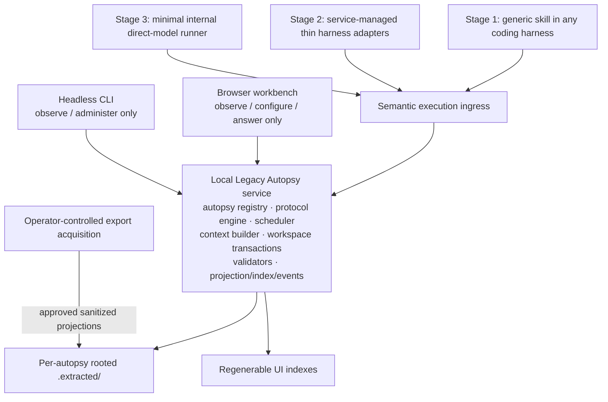

# Architecture

> Non-authoritative implementation guide. [`protocol.md`](../protocol.md) is normative and resolves every conflict.

## Product direction

Legacy Autopsy is evolving into a local-first interactive autopsy workbench and orchestration service. The governing boundary is:

> **Legacy Autopsy owns orchestration and protocol state. Executors own semantic work.**

The service is the target runtime owner of scheduling, bounded context construction, validation, workspace transactions, projections, events, and human interaction. Execution channels are deliberately staged: a generic skill usable from any coding harness first, service-managed thin harness adapters second, and a minimal internal direct-model runner last. All eventually share the same logical invocation/result contract, but the UI and CLI cannot manually start semantic work during the skill-first stage.

See [runtime.md](runtime.md) for the conceptual multi-autopsy, executor, Atlas, questions, and workbench design.

## Current M0 boundary

M0 provides a short-lived Go CLI, thin skill routing, structural Markdown foundations, initial identities/path handling, workspace scaffolding/checks, confined context assembly, bootstrap fixtures, and CI. It does not provide a long-lived service, multi-autopsy registry, scheduler, executor abstraction, browser UI, Atlas projection, questions inbox, semantic invocation execution, complete cold resume, protocol schemas, canonical hashing, gates, acquisition, synthesis, confirmations, handbook generation, or packaging.

Current commands operate on one declared repository/workspace at a time and exit. That is not multi-autopsy orchestration.

## Target boundaries and flow

- **Normative protocol:** execution law, records, authority, modes, invariants, and gates; never generated from implementation metadata.
- **Local service:** coordinates many isolated autopsies and owns the runtime state machine, scheduling, validation, commit boundary, and event ordering.
- **Autopsy boundary:** explicit `autopsy_id`, repository root, pinned snapshot, rooted workspace, lifecycle, limits, questions, and projections. Isolation is not inferred from filenames.
- **Protocol engine and context builder:** route exact normative sections and assemble complete fingerprinted read sets for one bounded invocation.
- **Execution channels:** the generic skill is first and initially exclusive; named harness adapters add managed runners second; direct-model execution is the final minimal method. No channel may authorize its own writes, commits, gates, or state transitions.
- **Per-project configuration:** reserved `.legacy-autopsy/` operational files select adapters and limits without becoming protocol/evidence authority; `.extracted/` remains separate and authoritative.
- **Workspace transaction manager:** revalidates scope, ownership, stale inputs, and implemented rules before atomically committing protocol effects.
- **Deterministic core:** owns identity, parsing, scope, ordering, canonicalization, hashing, validation, and state transitions as implemented.
- **Workspace:** `.extracted/` remains persistent authoritative protocol state; conversation memory is disposable.
- **Projections:** Atlas, search, event acceleration, and UI caches are regenerable non-authoritative derivatives of committed records.
- **Clients:** during the first stage, the browser and CLI observe, configure, administer, and present authorized human actions but cannot manually start or claim semantic work; the skill is the only semantic-work ingress.
- **Acquisition boundary:** an independent operator tool keeps raw Appsmith/n8n material private and publishes only approved sanitized projections.

## Authority and isolation

Service registry, scheduler, lease, event, browser, and `.legacy-autopsy/` project-configuration state are operational state—not semantic, evidence, or gate authority. `.legacy-autopsy/` must remain distinct from authoritative `.extracted/` records and must not contain credentials or secret values. Every service operation must carry `autopsy_id`; every filesystem operation must also bind declared repository/workspace roots and snapshot identity, reject traversal and symlink escape, and prevent cross-autopsy access.

The service may manage many autopsies in one process, but each `.extracted/` workspace remains independently validated and transacted. Service-owned writes publish revisions through a deterministic post-commit hook. An optional filesystem watcher handles only out-of-band changes and forces re-read/revalidation, with full startup reconciliation as fallback. Atlas updates run afterward as lower-priority, regenerable representation work and emit their own readiness events. Atlas lag or failure cannot block extraction, consume semantic-executor priority, or invalidate authoritative state. Speculative executor reasoning never becomes evidence or committed graph truth.

## Initial local-first operating model

Start with deliberately basic mechanisms and add complexity only when observed failures justify it:

- generate an opaque random `autopsy_id`, persist it in project configuration, preserve it across relocation, and fail closed on duplicate active roots;
- install one user-level OS service with a registry in the user's application-data directory and reconcile it with project/workspace state on restart;
- allow one active semantic invocation per autopsy, two globally, FIFO within an autopsy, and round-robin across autopsies;
- use per-autopsy in-process locking, invocation-ID idempotency, cooperative cancellation, bounded explicit retries, and interrupted-claim recovery;
- evolve a small versioned executor envelope additively as skill/adapter needs surface;
- listen only on loopback with no account/client authentication or external serving, while enforcing `Host`, `Origin`, CSRF, and secret-safe logging controls;
- store lower-priority Atlas derivatives beneath `.legacy-autopsy/atlas/*`; extraction and authoritative commits never wait for them;
- run with the current OS user's directory permissions; elevated access and desktop packaging remain out of scope.

See [runtime.md](runtime.md) for exact baseline behavior and adaptation points.

## Language decision: Go

The M0 foundation is implemented in Go for cross-platform distribution, strong standard-library filesystem/hashing/serialization support, explicit fail-closed errors, and no external runtime dependency after compilation. These properties also suit the target local service, concurrency boundaries, event delivery, and rooted workspace operations. Future build-time modules must be justified and pinned behind project-owned, provider-neutral interfaces.

## UI technology direction

The browser workbench will use Angular with Taiga UI. Atlas visualization and ego-graph interaction will use Cytoscape. The frontend build will use Analog's Vite plugin as Angular/Vite integration, not the full Analog framework. Exact versions and package boundaries remain implementation-time decisions and must be pinned when introduced.

The initial graph representation is JSON under `.legacy-autopsy/atlas/*`; the initial local API is loopback HTTP with SSE updates. Embedded graph storage or WebSocket may replace/add to those choices only when measured needs justify them. Desktop packaging remains out of scope.

## Current packages

- `internal/markdown`: limited structural nodes and source spans used by M0 readers.
- `internal/protocol`: protocol version, heading, mode registry, and exact section extraction.
- `internal/routing`: manifest/projection drift checks.
- `internal/identity`: foundational typed IDs and relative-path normalization; specialized identities remain unsupported.
- `internal/canonical`: deliberately limited basic Markdown fingerprinting, not the §4.1.2 canonical profile.
- `internal/workspace`: atomic skeleton initialization and early structural checks.
- `internal/contextpacket`: identity validation, confined reads, exact routed text, and packet rendering; automatic closure/stale comparison remain deferred.
- `internal/fixtures`: registered bootstrap cases and stable diagnostic matching.
- `internal/cli`: current short-lived command wiring.

No service, scheduler, executor, HTTP/event, graph, or UI package exists today. Planned runtime responsibilities remain conceptual until implemented under the [roadmap](roadmap.md). The service/application layer should orchestrate provider-neutral packages; the target CLI should remain a thin client rather than contain protocol logic.

## Structural Markdown direction

The current parser recognizes headings, emphasized fields, fenced blocks, comments, tables, paragraphs, blanks, and bounded sections. Later milestones must deepen it for typed-record boundaries, complete field paths, table schemas, certification/artifact envelopes, canonical serialization, and stable anchors. Protocol-significant validation must remain structural; regex is appropriate only after locating a protocol-defined regex-constrained value.

## Safety and persistence

Reads and writes use declared roots and path normalization; M0 context reads also reject traversal and symlink escape. Future mutations require restrictive permissions where sensitive, atomic publication, stale-input checks, explicit autopsy scoping, and cross-autopsy isolation tests. Persistent authority comes from validated filesystem records, never chat history, service memory, a graph database, or browser state.
