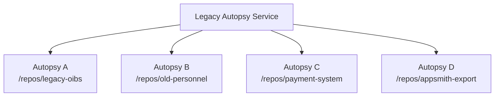
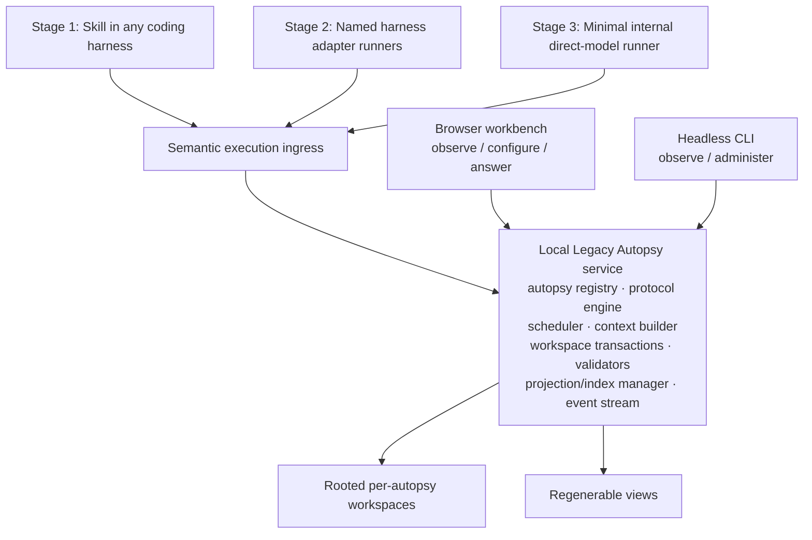
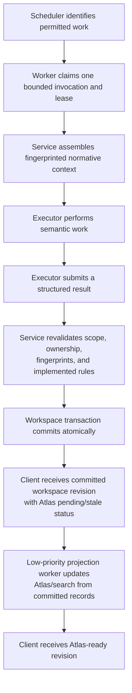
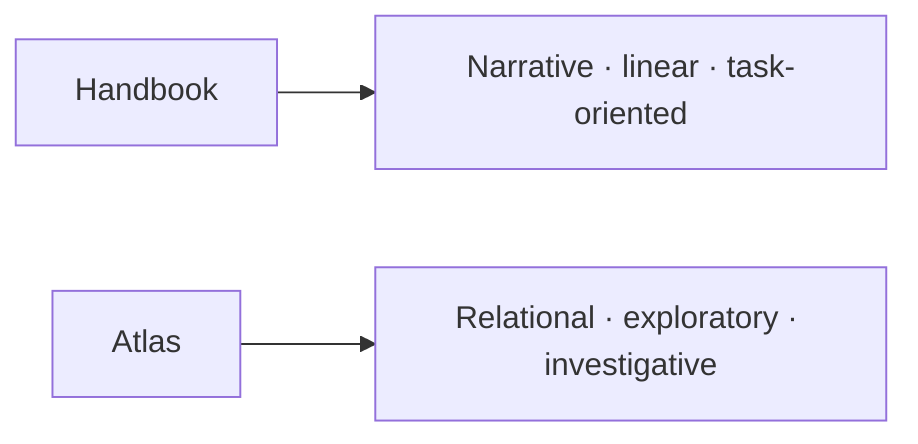

# Local autopsy runtime and workbench

> Non-authoritative target design for one reference/tooling implementation. [`protocol.md`](../protocol.md) is a standalone, implementation-independent specification and remains the sole normative authority. None of the Legacy Autopsy service, scheduler, executor adapters, Atlas, browser, or CLI behavior described here is required to execute the protocol or implemented in M0 unless stated otherwise.

## Product boundary

Legacy Autopsy is evolving into a local-first interactive environment where humans and executors collaboratively build an evidence-backed model of a legacy system.

> **In Legacy Autopsy-managed execution, Legacy Autopsy owns orchestration of protocol-defined workspace state. Executors own semantic work.**

The target runtime is a long-lived local service. It coordinates bounded protocol invocations, validates and commits their effects, projects committed state for exploration, and keeps human interaction available while work proceeds.

Execution channels arrive in a strict user-facing order: first a generic skill that works inside any compatible coding harness; second service-launched thin adapters for named harnesses; and only then a minimal internal direct-model runner. All channels eventually share one logical invocation/result contract, but they are not coequal rollout priorities.

## Authority model

| Layer                                                   | Role                                                                                                 | Authority                                         |
| :------------------------------------------------------ | :--------------------------------------------------------------------------------------------------- | :------------------------------------------------ |
| `protocol.md`                                           | Normative rules, modes, invariants, records, and gates                                               | Sole normative authority                          |
| Committed `.extracted/` records                         | Persistent forensic, assurance, synthesis, and handbook state within their protocol-defined concerns | Authoritative protocol state                      |
| Source snapshots and approved projections               | Evidence inputs cited by records                                                                     | Evidence authority as defined by the protocol     |
| Service registry, scheduler, leases, and event delivery | Operational coordination                                                                             | Not semantic or gate authority                    |
| Per-project `.legacy-autopsy/` configuration/state      | Adapter selection, limits, and local runtime coordination                                            | Non-authoritative operational state               |
| Atlas, search, and UI caches                            | Regenerable views over committed records                                                             | `NON-AUTHORITATIVE-DERIVATIVE`                    |
| Executor context and transient reasoning                | Bounded work material                                                                                | Never evidence merely because a model produced it |
| Conversation and browser session state                  | Interaction convenience                                                                              | Disposable                                        |

The service must derive protocol truth from validated workspace state. Operational state may coordinate work but cannot create evidence, settle contradictions, establish coverage, or pass Exit A or Exit E.

## Multi-autopsy model

One service process should manage multiple independent autopsies:



Each autopsy binds an explicit `autopsy_id` to:

- one repository root and pinned snapshot identity;
- one rooted `.extracted/` workspace;
- lifecycle and scheduler state;
- executor configuration and resource limits;
- questions, tickets, frontiers, and human-required actions;
- graph/search projection state;
- coverage and gate state read from authoritative records;
- an event stream scoped to that autopsy.

Lifecycle states may include `running`, `paused`, `waiting-human`, `idle`, `completed`, and `failed`; exact states remain a design decision. The isolation boundary is the autopsy/workspace, not the service process.

Every task, claim, context packet, result, transaction, event, and projection operation must carry `autopsy_id`. Filesystem access must additionally bind the repository root, workspace root, and pinned snapshot, then reject traversal, symlink escape, or cross-autopsy access. Different filenames or directories alone are not an isolation mechanism.

Shared service infrastructure may include provider clients, coding-harness adapters, worker pools, logging, HTTP/event transport, and a common browser shell. It must not merge protocol state between autopsies.

## Target service boundaries



During the skill-first stage, semantic work can begin only when the skill is invoked from a coding harness. The UI and CLI may observe, configure, attach, pause, resume, and present authorized human actions, but they must not manually start or claim a semantic invocation. Service-launched harness adapters introduce managed runners in Stage 2; direct model execution remains Stage 3.

The protocol engine interprets implemented deterministic rules and routes exact normative sections; it does not replace the protocol. The workspace transaction boundary revalidates fingerprints and authorization before committing. Events and projections follow a successful commit rather than preceding it.

## Local API trust boundary

The initial service runs only in the current user's OS session and listens exclusively on loopback. It has no user accounts or client-authentication layer and does not support external serving. The service must reject non-loopback binds, validate `Host` and browser `Origin`, disable permissive CORS, protect mutating browser requests against CSRF, and keep secrets out of logs/event payloads. These controls prevent unrelated web content from using the browser as a path to localhost; they are not a remote-access security model. Remote access remains out of scope.

## Executor contract

All executor kinds should share one logical task boundary:

```go
type Executor interface {
    Execute(ctx context.Context, invocation Invocation) (Result, error)
}
```

This signature is illustrative, not an implemented API. Execution support should be delivered in this order:

1. **Generic skill / bring-your-own-harness.** The user invokes the skill inside any compatible coding harness. The skill discovers or starts the service, attaches the project, claims bounded work, and submits results. The service does not launch the harness.
2. **Thin named harness adapters.** Service-managed runners launch or coordinate supported harnesses such as OpenCode, Codex, Claude Code, Kiro, or similar tools. Each adapter translates the common invocation/result contract without owning protocol state.
3. **Minimal internal direct-model runner.** Only after the external-harness paths are stable, add direct local/remote model API execution as the final method. It must use the same contract and gain no broader authority.

Human-required actions remain protocol-governed UI/operator transactions, not a general semantic executor channel.

An invocation must remain bound to one autopsy and the complete applicable protocol identity, scope, read set, write set, snapshot, and input fingerprints. A result is a semantic proposal until the service validates it. Executors classify behavior, formulate claims, identify ambiguity, and propose prose or other semantic content with provenance. The service computes or independently reproduces protocol-defined IDs, canonical forms, fingerprints, scope/stale checks, FSM transitions, counts, completeness, gates, and package verification before commit; an executor-supplied deterministic value never becomes authoritative merely because it is present. Executors do not own scheduling, stale checks, workspace commits, gate state, or the protocol state machine.

The common result envelope must carry the Protocol §8.5 semantic cold-resume assessment. Before every commit, the service adds its deterministic identity/scope/write-right/stale validation, recomputes the cold-resume fingerprint, and binds the pass/fail result to the mandatory `0G` entry. Failed or missing checks reject semantic mutation while preserving the exact no-mutation audit outcome.

## Per-project operational configuration

Runner and adapter configuration should be project-scoped under a reserved `<repository>/.legacy-autopsy/` root. This root is separate from `.extracted/`: it may describe adapter selection, executable paths, model/provider references, limits, points of interest, and non-semantic service preferences, but it is never protocol or evidence authority.

The exact JSON, YAML, SQLite, or mixed layout remains undecided. The design must distinguish declarative non-secret configuration from mutable local runtime state. Credentials and secret values stay outside the repository and both workspace roots. Mutable databases, leases, caches, logs, and private machine paths must not be committed; any intentionally shareable project configuration must remain synthetic/non-sensitive and explicitly documented.

## Claim, execute, and commit flow



One claim corresponds to one protocol invocation. A worker must not silently switch mode, persona, cluster, track, POV, or autopsy. Submission after stale inputs must reject semantic mutation rather than commit optimistically. Every started invocation still receives the mandatory `0G` append: rejected, stale, blocked, or unsupported results record their exact no-mutation outcome, cold-resume check fingerprint, blockers, and next loads under the applicable workspace transaction boundary. Unsupported validation or mutation remains `unsupported`; the service must not create placeholder success.

Gate and packaging reports are service-computed deterministic effects. The service must enforce the protocol-versioned exact check registries, reject empty/missing/duplicate/unknown check sets, recompute row evidence-set fingerprints and cross-artifact snapshot equality, and expose reproducible final-bundle verification. Any final verification receipt is operational `NON-AUTHORITATIVE-DERIVATIVE` state outside the certified package and `.extracted/`; it records the run but cannot establish or change Exit E.

Speculative model thoughts, streamed tokens, and uncommitted result drafts may appear as executor activity but must never appear as committed graph truth or evidence. Client events may announce an authoritative commit immediately after that commit; derivative-ready events occur only after the corresponding projection update. Atlas lag or failure must never block extraction, consume semantic-worker priority, invalidate a workspace commit, or prevent later protocol work.

## Workspace update channels

Service-owned writes are the primary update channel. The workspace transaction manager already knows the `autopsy_id`, invocation, changed records, and committed workspace revision, so a post-commit hook should immediately publish that revision to Activity/Inspector and enqueue lower-priority Atlas regeneration.

An optional filesystem watcher is a fallback for out-of-band `.extracted/` changes, not the normal commit path. A watcher event proves only that bytes may have changed. It must bind the event to one autopsy/root, debounce and deduplicate it, re-read and fingerprint affected records, mark the workspace externally changed, and require applicable validation before later mutation. It must not manufacture an invocation, evidence, or a valid protocol transition.

Watchers may miss, duplicate, or reorder events. Service startup and watcher overflow therefore require a full disk reconciliation. Service-originated commit revisions should suppress duplicate watcher notifications without suppressing genuinely different external changes.

## Scheduling and concurrency

Concurrency exists at two levels:

1. **Service concurrency:** independent autopsies run in one service.
2. **Autopsy concurrency:** independent permitted invocations or frontiers progress within one autopsy.

The scheduler must preserve protocol ownership, reconciliation, and transaction boundaries. Parallel workers cannot gain broader write rights or bypass modes that exclusively own shared merges. Future controls may include global worker limits, per-autopsy limits, priorities, and executor/model quotas.

A blocked question or frontier should release its worker. Other independent work may continue unless the blocked dependency closure prevents all permitted progress. Pausing one autopsy must not pause others.

The initial retry, idempotency, interrupted-claim recovery, and round-robin behavior is defined below. Lease-expiry details beyond restart interruption and any future multi-process service ownership remain open design decisions.

## Browser workbench

The planned browser stack is Angular with Taiga UI for the workbench surfaces and Cytoscape for Atlas visualization and interaction. Build integration will use Analog's Vite plugin, not the full Analog framework. Exact package versions, application layout, and integration boundaries will be fixed when the UI milestone begins.

The browser is a manager for multiple autopsies, not a view trapped inside one repository. A top-level tab model should make state visible:

```text
[ ÖBS ● ] [ Personnel 3? ] [ Payment ✓ ] [ + New Autopsy ]
```

Indicators may show running/paused/waiting/blocked state, open-question count, Exit A progress, or completion. An autopsy view should evolve toward these first-class surfaces:

- **Atlas:** explorable typed ego graph;
- **Inspector:** selected record, provenance, status, and relationships;
- **Questions:** asynchronous human inbox and impact;
- **Activity:** claimed work, commits, failures, and events;
- **Coverage / Gates:** projections of validated assurance state;
- **Source / Evidence:** exact coordinates and claims;
- **Handbook:** human reconstruction guidance linked to underlying records.

UI state does not authorize mutations or establish protocol state. A UI action that answers a question initiates the applicable authorized transaction; it does not itself imply ticket closure, decision approval, confirmation, coverage, or a gate result.

## Atlas projection

Atlas should render an ego graph centered on a selected node, with configurable expansion depth and filters such as relation type, plane, persona, traversal/capability state, evidence state, active/conditional/disabled state, uncertainty, contradiction, and ticket state.

Nodes may project personas, components, use cases, business rules, entities, relationships, interfaces, dependencies, configurations, schedulers, faults, claims, sources, decisions, and handbook entries. Edges must be typed and inspectable. Every displayed relationship must answer: **Why does Legacy Autopsy believe A relates to B?**

The answer must resolve to committed forensic/assurance records and evidence provenance. Atlas must distinguish authoritative atomic relationship records from its own non-authoritative representation of them.

The initial projection lives under `.legacy-autopsy/atlas/*` as JSON. It may later move to an embedded database behind the same rebuild contract. Whatever the storage:

- it must be reproducible from validated committed workspace records;
- it must carry source fingerprints, schema/generator version, generation time, and a `NON-AUTHORITATIVE-DERIVATIVE` marker;
- canonical workspace records win every conflict;
- rebuilding it must not change semantic or gate state.

Atlas is a representation layer, never part of extraction closure or scheduling priority. After each authoritative workspace commit, publish the committed workspace revision with Atlas status `pending` or `stale`, then enqueue a lower-priority projection update. When it completes, publish the Atlas revision separately. Projection failure leaves the workspace commit valid, marks Atlas stale, and schedules a rebuild; it cannot block extraction or protocol progress.

## Handbook links

Atlas and the handbook are complementary projections:



A graph node should navigate to related handbook sections, and handbook content should open Atlas centered on its underlying semantic or forensic record. Stable bidirectional identities depend on later HBK/anchor work and must not be improvised before those identities are implemented.

## Questions and Human Hatch

The Questions surface is an asynchronous inbox over protocol-governed tickets, decisions, confirmations, probes, and human-required actions plus non-authoritative operational metadata.

Each item should show, where deterministically derivable:

- the causing record, claim, ticket, or contradiction;
- the applicable authorized action and required inputs;
- what is blocked and what remains runnable;
- the downstream records/frontiers that an accepted answer may release;
- pinned fingerprints and authority requirements.

Question impact may inform priority, but must not manufacture protocol semantics. Human Hatch prerequisites and subtype rights remain governed by the protocol. Ticket escalation must expose the closed protocol reason—runtime required, third-party opacity, unavailable authority/fact/domain meaning, unsafe/destructive access, or unavailable sandbox—and the validated static-investigation/probe-feasibility record. Non-runtime reasons must not be forced through a fake runtime-probe state. A human-required terminal ticket remains an unresolved coverage gap/partial state, is visibly distinct from an exact approved exclusion, and blocks any scope claiming its closure while unrelated work may continue. A human answer becomes effective only after the applicable validation and workspace transaction succeed.

## Project registration and points of interest

In the skill-first stage, the skill identifies or registers the current project when it attaches to the service; the UI and CLI do not manually start an autopsy run. Later configuration surfaces may let a user choose a project directory and provide known points of interest: frontend/backend entries, schema or scheduler definitions, export/workflow directories, important modules/files, or free-form notes. Registering or configuring a project still does not start semantic work.

These inputs are discovery seeds only. They are not evidence, denominator proof, ownership assignments, or behavioral truth. Exact `.legacy-autopsy/` representation and sanitization details remain adaptation points; the initial relocation and current-user permission behavior is defined below.

## Client roles

- **Skill:** first and initially exclusive semantic-work ingress. It works inside any compatible coding harness, attaches the project, claims permitted work, retrieves context, and submits results.
- **Browser UI:** primary observation, exploration, configuration, and authorized human-action surface. It cannot manually start or claim semantic work in the skill-first stage.
- **CLI:** current bootstrap interface; target headless observation/administration client. It cannot manually start or claim semantic work in the skill-first stage.
- **Named harness adapters:** second-stage thin managed runners for supported external coding harnesses.
- **Internal direct-model runner:** final-stage minimal executor for local or remote model APIs.

Potential future CLI concepts include `serve`, `attach`, `status`, questions/answer, pause/resume, graph export, and validate. Worker claim/context/submit remains an adapter/skill integration boundary rather than an operator command for manually starting work. None of these proposed commands is implemented or belongs in current copy-paste workflows.

## Current support and rollout

M0 implements a short-lived CLI, protocol/skill routing validation, workspace scaffolding/checks, foundational identities/path handling, bounded context-packet assembly, bootstrap fixtures, and CI. It does not implement the service, multi-autopsy registry, scheduler, executor API, browser UI, Atlas, questions inbox, semantic mode execution, or full conformance.

The [roadmap](roadmap.md) introduces the service shell after foundational protocol, identity, and workspace mechanics. Execution then matures in strict order: generic skill in any harness, named harness adapters with per-project `.legacy-autopsy/` configuration, and finally the minimal internal direct-model runner.

## Initial local-first baselines

These choices favor the smallest coherent local implementation. They should be instrumented and revised when observed failures justify more machinery.

- **Autopsy identity:** generate one opaque random `autopsy_id` at first registration and persist it in project configuration. Repository relocation preserves the ID; an explicit reattach updates the service registry. If the same ID appears at two active roots, fail closed and require the user to choose which registration survives or regenerate one copy.
- **Service installation and recovery:** install one user-level OS service and keep its registry in the user's application-data directory. On startup, reload the registry and reconcile each entry against its `.legacy-autopsy/` configuration, repository root, pinned snapshot, and `.extracted/` workspace. The registry coordinates discovery; it does not replace workspace authority.
- **Concurrency and reliability:** begin with one service process, one active semantic invocation per autopsy, a global worker limit of two, and simple round-robin selection across runnable autopsies. Use a per-autopsy mutex, invocation ID as the idempotency key, cooperative cancellation, bounded retries for explicitly retryable failures, and mark in-flight claims interrupted on restart before requeueing them.
- **Executor envelopes:** start with a small versioned invocation/result envelope containing identities, scope, fingerprints, context/result payload references, status, and diagnostics. Evolve it additively as real skill and adapter needs surface; unsupported capabilities fail explicitly.
- **Local API:** bind loopback only, with no account or client authentication and no external serving. Enforce the `Host`/`Origin`/CSRF and secret-safe logging controls above. Start with ordinary HTTP plus SSE for server-to-browser updates; introduce WebSocket only if a concrete bidirectional streaming need appears.
- **Scheduler policy:** start with the global limit of two, per-autopsy limit of one, FIFO within an autopsy, and round-robin across autopsies. Human-blocked work releases its slot. Add priorities, quotas, or impact heuristics only from measured starvation or latency.
- **Atlas storage:** write the regenerable projection beneath `.legacy-autopsy/atlas/*`, with workspace source revision/fingerprints, projection schema/generator version, generation time, and `NON-AUTHORITATIVE-DERIVATIVE` marking. JSON is the simplest initial representation; an embedded database can replace it behind the same rebuild contract if scale requires.
- **Commit, notification, projection:** first commit authoritative `.extracted/` state (including the required `0G` entry), then use the service's post-commit hook to notify clients with the workspace revision and Atlas status `pending`/`stale`. Enqueue `.legacy-autopsy/atlas/*` regeneration on a lower-priority projection worker and emit a separate Atlas-ready event when it catches up. An optional watcher detects out-of-band edits and triggers revalidation/full reconciliation; it is never the authority for service-owned writes. Projection lag or failure never blocks extraction, consumes a semantic worker slot, or invalidates the workspace commit.
- **Filesystem permissions:** run entirely as the current OS user and rely initially on that user's normal directory permissions. Project registration may select only paths accessible to that user. Desktop packaging and elevated/background system-wide access are out of scope.

## Known adaptation points

- exact `.legacy-autopsy/` split and format for shareable configuration, mutable state, adapter metadata, and ignored machine-local files;
- harness adapter process control, executable discovery, version/capability negotiation, cancellation, and streamed output;
- executor envelope evolution and compatibility policy as named adapters are implemented;
- event retention/replay and operational question metadata;
- thresholds that justify concurrent invocations within one autopsy, scheduler heuristics, WebSocket, or non-JSON Atlas storage.
