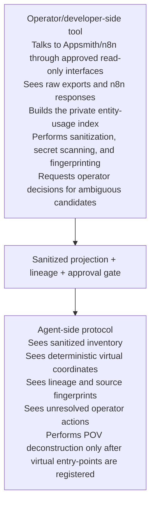

# Export Acquisition Helper Architecture

- **Status:** Proposed for M8; not implemented
- **Normative authority:** [`protocol.md`](../../protocol.md), primarily Part 7, with related requirements in Sections 5.3, 5.6, and 8
- **Primary purpose:** Define a possible local, operator-run CLI that discovers, sanitizes, fingerprints, and maps Appsmith/n8n serialized exports into protocol-compatible agent-visible inventory without exposing raw credentials, raw exports, or private matching state to agents.

This document is a non-authoritative design proposal. The current repository contains only the [M0 export-helper boundary](README.md); commands, schemas, and operational capabilities described below remain unimplemented until their roadmap milestones are completed.

## 1. Context

Appsmith can provide a complete application as one serialized export. n8n workflows are commonly acquired as separate workflow exports and may invoke other workflows that have not yet been supplied. Some relevant n8n workflows are not exposed through webhooks or API endpoints; they may be triggered by schedules, queues, database events, error handlers, manual execution, or other workflows.

The helper therefore cannot rely only on endpoint matching. It must combine:

1. direct references discovered in Appsmith;
2. n8n workflow-to-workflow traversal;
3. entity-usage matching across configuration, environment references, databases, APIs, queues, files, and domain identifiers;
4. a small human review loop for ambiguous matches.

The helper is a local developer/operator-side acquisition tool. It discovers, sanitizes, fingerprints, and maps serialized exports into protocol-compatible inventory. It runs outside agent execution, never executes production workflows, never mutates Appsmith or n8n, and never exposes raw credentials, raw exports, private matching state, or unredacted n8n responses to agents. Agents may inspect its source code and approved outputs, but must not invoke live acquisition with production credentials.

## 2. Goals

- Discover n8n workflows directly invoked by Appsmith.
- Discover non-endpoint n8n workflows through shared entity usage.
- Recursively acquire referenced sub-workflows and configured error workflows.
- Produce deterministic virtual coordinates compatible with the deconstruction protocol.
- Emit sanitized, fingerprinted artifacts into an agent-visible inventory.
- Keep API keys, secrets, raw exports, and private matching hints outside the repository.
- Reduce human involvement to reviewing ambiguous candidates and inaccessible artifacts.
- Preserve enough lineage to reproduce and audit every generated artifact.

## 3. Non-Goals

- Determining legal or regulatory compliance.
- Exporting or reconstructing n8n credential secret values.
- Executing production workflows.
- Mutating Appsmith or n8n instances.
- Guessing dynamically computed workflow references.
- Claiming that entity co-usage proves a behavioral dependency.
- Replacing the protocol's POV extraction and evidence rules.

## 4. Trust Boundary



Raw input should be read from paths outside the repository. Temporary files should use an operator-only system directory and be deleted after completion. The helper must not transmit exports, secrets, or repository content to third-party services.

## 5. Proposed Repository Layout

```text
tools/
  export-helper/
    src/
    config.example.*
    README.md

inventory/
  appsmith/
    sanitized-application.json
    export-map.json
  n8n/
    workflows/
      [workflow-id]--[normalized-name].json
    export-map.json
  manifests/
    acquisition.json
    lineage.json
    candidate-workflows.json
    entity-correlation-summary.json
    sanitization-report.json
  unresolved/
    operator-actions.json
  protocol-bridge/
    0A-PREFLIGHT.fragment.md
    entrypoint-clusters.fragment.md
    export-acquisition-register.fragment.md
    security-privacy.findings.fragment.md
    unresolved-discovery-queue.fragment.md
```

`inventory/` contains generated, sanitized artifacts only. Raw inputs and private matching state must be excluded by construction, not merely by `.gitignore`.

The private entity-usage index must never be written to `inventory/`. `entity-correlation-summary.json` is an agent-visible sanitized projection containing only deterministic aliases, normalized non-sensitive entity classes, relationship categories, and approved candidate explanations. It must not contain raw table literals, credential names, internal hostnames, row values, private configuration values, or unredacted matching hints.

### 5.1. Proposed CLI Shape

The following commands illustrate one possible local CLI decomposition for developers and operators. They are design inputs, not implemented commands or a stable CLI contract:

```text
export-helper init
export-helper scan-appsmith --input /operator/private/appsmith-export.json
export-helper scan-n8n --api-url ... --auth env:N8N_API_KEY
export-helper resolve
export-helper review
export-helper publish --out ./inventory
export-helper bridge --out ./inventory/protocol-bridge
export-helper verify-inventory
```

Command responsibilities:

- `init` creates operator-local configuration/state and validates output boundaries.
- `scan-appsmith` parses a private Appsmith export without publishing it.
- `scan-n8n` performs approved read-only discovery; `--auth` identifies a credential source and never carries the credential value.
- `resolve` builds direct graph closure and entity-correlation candidates in private state.
- `review` presents ambiguous candidates, secret findings, and scope decisions to the operator.
- `publish` writes only approved sanitized inventory and manifests.
- `bridge` renders deterministic protocol fragments from approved sanitized manifests.
- `verify-inventory` rechecks fingerprints, lineage, schemas, secret-scan attestations, and output boundaries without contacting source systems.

Safety defaults:

- Default mode is dry-run.
- Publishing and bridge generation require explicit operator approval.
- Raw input paths must be outside the repository.
- Generated output paths must be inside `inventory/` or explicitly approved protocol-fragment directories.
- API keys must not be accepted as command-line arguments.
- Secret findings fail closed.
- Unsupported export versions fail closed.
- Agents must not invoke live acquisition commands with production credentials.

## 6. High-Level Components

### 6.1. Appsmith Reader

Reads a complete Appsmith application export and extracts logical units:

- pages and widgets;
- JSObjects and event handlers;
- queries and datasource references;
- API actions and navigation actions;
- bindings and validation expressions;
- environment/configuration references;
- possible n8n webhook URLs, workflow IDs, and domain identifiers.

It produces an in-memory logical map and an agent-safe normalized export.

### 6.2. n8n Source Adapter

Obtains workflow metadata and definitions using a read-only mechanism. Adapter priority:

1. supported n8n API access;
2. operator-generated n8n CLI exports;
3. an explicitly approved, version-specific, read-only database adapter as a last resort.

A database adapter must never query credential-secret tables or write to the n8n database. Version-specific adapters must fail closed when the detected schema is unsupported.

### 6.3. Logical Explosion Engine

Transforms each serialized application or workflow into deterministic virtual artifacts:

```text
[source-file]#[logical-kind]/[stable-id]--[normalized-name]
```

It inventories nodes, pages, widgets, actions, queries, bindings, and graph edges without performing behavioral analysis outside assigned persona entry-points.

### 6.4. Entity Usage Indexer

Builds a private reverse index from normalized entity keys to the Appsmith and n8n artifacts that use them. This is the primary mechanism for discovering relevant workflows that have no exposed endpoint.

The private index exists only within the operator-side trust boundary and must never be persisted under `inventory/`. The Inventory Writer may derive `inventory/manifests/entity-correlation-summary.json` only after sanitization and operator approval. That projection contains aliases, non-sensitive entity classes, relationship categories, candidate scores, and approved explanations—not the raw values used for matching.

### 6.5. Workflow Graph Resolver

Recursively follows direct n8n relationships:

- Execute Workflow nodes;
- configured error workflows;
- statically resolvable workflow IDs or names in expressions/code;
- webhook/API relationships;
- queue or event relationships when both producer and consumer identifiers are static.

Dynamic targets are never guessed. They are emitted to the unresolved queue.

### 6.6. Sanitizer and Secret Scanner

Transforms raw logical artifacts into agent-safe outputs. It uses field-aware redaction plus content scanning and blocks publication when suspicious values remain.

### 6.7. Inventory Writer

Writes deterministic filenames, manifests, fingerprints, lineage, candidate explanations, and operator actions. It performs atomic writes so partial runs do not appear complete.

### 6.8. Operator Review Gate

Presents ambiguous workflow candidates and blocked sanitization findings. Only approved artifacts cross into `inventory/`.

## 7. Entity-Usage Discovery

### 7.1. Why Entity Matching Is Required

Endpoint matching finds workflows called directly by Appsmith, but it misses workflows such as:

- scheduled reconciliation jobs operating on the same tables;
- queue consumers processing entities created by Appsmith;
- error workflows attached to directly referenced workflows;
- database polling workflows;
- file-processing workflows using the same storage locations;
- workflows driven by environment/configuration keys;
- internal sub-workflows with no external trigger.

Entity co-usage identifies candidates for review; it does not by itself prove a call relationship.

### 7.2. Entity Categories

The indexer should extract the following categories where statically observable:

| Category             | Examples                                               | Matching Notes                                                     |
| :------------------- | :----------------------------------------------------- | :----------------------------------------------------------------- |
| Workflow             | n8n workflow ID/name, error workflow ID                | Exact stable-ID matches are authoritative structural links.        |
| Web/API              | host alias, normalized path, method, operation name    | Strip secrets and volatile query values before matching.           |
| Database             | engine, database alias, schema, table, view, procedure | Prefer parsed identifiers; avoid indexing row values.              |
| Query                | normalized SQL operation and referenced entities       | Preserve operation type and entity names, not sensitive literals.  |
| Config/environment   | environment key, config path, feature flag name        | Match names privately; redact or alias sensitive names in output.  |
| Queue/event          | broker alias, topic, queue, routing key, event type    | Producer/consumer co-usage is a strong candidate signal.           |
| Storage              | bucket alias, path prefix, file pattern                | Remove credentials, signed parameters, and user-specific paths.    |
| Domain identifier    | entity type, operation code, status enum               | Use only sufficiently specific identifiers to avoid noisy matches. |
| Credential reference | local credential ID/name alias                         | Never fetch secret values; use private deterministic aliases.      |

### 7.3. Appsmith Entity Extraction

The Appsmith reader collects candidate entities from:

- datasource metadata;
- SQL and query bodies;
- API action URLs, paths, methods, headers, and body templates;
- JSObject code and expressions;
- widget bindings and event handlers;
- environment/configuration references;
- navigation parameters and action chains.

Secret-bearing fields are scanned before indexing. Matching may occur in private memory using original values, but generated output contains only sanitized values or deterministic aliases.

### 7.4. n8n Entity Extraction

The n8n indexer scans all accessible workflow definitions—not only active or webhook-triggered workflows—for:

- node types and trigger types;
- workflow/sub-workflow IDs;
- configured error workflows;
- SQL statements and database entities;
- API hosts, paths, methods, and operation names;
- `$env` and other configuration references;
- queue topics, event names, and routing keys;
- storage paths and file patterns;
- credential references;
- static identifiers inside expressions and code nodes.

The index is built locally before sanitization. Only selected and approved workflows are written to the repository.

### 7.5. Private Matching Hints

Some relationships cannot be inferred safely from exports—for example, an Appsmith datasource and an n8n credential may refer to the same database but use unrelated names. The operator may provide a private hints file outside the repository:

```yaml
aliases:
  - left: appsmith.datasource.PaymentDb
    right: n8n.credential.CRED-42
    entity: database/payment
```

The helper may use these aliases for matching, but must emit only a sanitized alias such as `DB-ALIAS-001`. The private hints file and original names never enter `inventory/`.

## 8. Candidate Scoring and Selection

Candidate scoring must be deterministic and explainable. Suggested starting weights:

| Signal                                                    | Score |
| :-------------------------------------------------------- | ----: |
| Exact workflow ID or configured error workflow            |   100 |
| Execute Workflow reference                                |   100 |
| Exact webhook path and method                             |    95 |
| Exact queue/topic plus compatible producer/consumer roles |    85 |
| Exact database procedure/view                             |    80 |
| Same schema/table with compatible read/write roles        |    65 |
| Same API host/path family                                 |    60 |
| Private operator-approved alias                           |    60 |
| Same specific environment/configuration key               |    35 |
| Generic domain token                                      |    10 |

Suggested handling:

- **90–100 with a direct structural signal:** Automatically include as a structurally linked workflow.
- **90–100 from entity co-usage only:** Require operator review; a high score does not manufacture a call edge.
- **60–89:** Include in the operator review queue with matching evidence.
- **30–59:** Record as a weak candidate; do not export without approval or another corroborating signal.
- **Below 30:** Ignore unless explicitly requested.

Multiple independent signals may combine, but scores should be capped at 100. Negative evidence—such as incompatible database engines or conflicting entity roles—should reduce the score. Candidate records must distinguish `structural-link` from `entity-correlation`; only the former may become an edge without human confirmation.

Each candidate record must explain its score without exposing sensitive values:

```json
{
  "workflowAlias": "WF-017",
  "score": 85,
  "relationshipClass": "entity-correlation",
  "signals": [
    "shared-table: DB-ENTITY-004",
    "compatible-role: appsmith-write/n8n-scheduled-read",
    "shared-config-alias: CFG-009"
  ],
  "decision": "operator-review"
}
```

## 9. Acquisition Algorithm

```text
1. Load raw Appsmith export outside repository.
2. Parse Appsmith logical units and extract direct n8n references/entities.
3. Authenticate to n8n locally using read-only access.
4. List all accessible workflow metadata with pagination.
5. Fetch workflow definitions into operator-only temporary memory/storage.
6. Build the private n8n entity-usage index.
7. Match direct Appsmith references to n8n workflows.
8. Score non-endpoint workflows through entity co-usage.
9. Recursively traverse approved workflows and their sub/error workflows.
10. Sanitize selected Appsmith and n8n artifacts.
11. Run secret scanning and block unsafe outputs.
12. Present ambiguous candidates and blocked findings to the operator.
13. Publish approved artifacts atomically into inventory/.
14. Generate acquisition, lineage, candidate, entity-correlation summary, and sanitization manifests.
15. Emit unresolved dynamic references to operator-actions.json.
16. After explicit approval, render deterministic protocol bridge fragments.
```

## 10. Recursive Closure Rules

A run is structurally complete when:

- all direct Appsmith-to-n8n references are resolved or explicitly unresolved;
- all selected workflows have been fetched and fingerprinted;
- all static sub-workflow and error-workflow references have been traversed;
- all high-confidence entity candidates have been included;
- all medium-confidence candidates have an operator decision;
- all dynamic references are represented in the unresolved queue;
- every published artifact passed sanitization and secret scanning.

A run is not complete merely because every webhook reference was found.

## 11. Secret Isolation and Sanitization

### 11.1. Credential Input

- API keys must be supplied through environment, stdin, or an OS credential store.
- API keys must never be accepted as command-line arguments.
- Authentication values must never appear in logs, errors, manifests, or process summaries.
- The helper must not make credentials available to agent-invoked subprocesses.

### 11.2. Raw Artifact Handling

- Read raw Appsmith exports from outside the repository.
- Keep raw n8n responses in memory where feasible.
- If temporary files are required, create them in an operator-only directory with restrictive permissions.
- Delete temporary artifacts on success and best-effort cleanup on failure.
- Never place raw exports in `inventory/`.

### 11.3. Sanitization Rules

At minimum, redact or alias:

- passwords, tokens, API keys, bearer headers, cookies, and private keys;
- credential objects, IDs, names, and connection strings;
- URL user information and sensitive query parameters;
- signed URLs and temporary access parameters;
- sensitive environment values;
- secrets embedded in code, expressions, SQL, or request bodies;
- internal hosts or topology when policy requires redaction.

Behaviorally relevant structure should be retained where safe: HTTP methods, normalized paths, SQL operation types, table aliases, node topology, expression shape, and payload schemas.

### 11.4. Fail-Closed Publication

Publication must fail if:

- secret scanning reports an unhandled high-confidence finding;
- an unknown field category cannot be safely classified;
- a sanitizer parser does not support the detected export version;
- output lineage cannot be linked to a source fingerprint;
- the operator rejects the review.

The sanitization report records categories, counts, artifact aliases, and locations—not secret values.

### 11.5. Evidence Semantics Under Sanitization

The raw export remains the operator-held source of truth. A published sanitized artifact is an **agent-visible evidence projection**, not proof that the agent inspected the raw source.

The lineage and sanitization manifests must identify, per logical field or section where practical, whether content was:

- preserved verbatim;
- structurally normalized without semantic change;
- redacted;
- removed;
- replaced by a deterministic alias.

Agents may assign `[E-DIRECT]` only to behavior preserved or semantics-preservingly normalized in the approved projection. Behavior that depends on redacted, removed, or unclassified content remains `[E-UNKNOWN]` or `[E-INFERRED]` and must create a ticket when material to the workflow. Credential aliases prove only that a reference exists; they do not verify credential values or runtime access.

## 12. Generated Manifests

### 12.1. `acquisition.json`

Tracks source fingerprints, workflow aliases, recursive closure state, and one protocol-defined acquisition tag:

```text
[A-REQUESTED]
[A-RECEIVED]
[A-EXPLODED]
[A-BLOCKED-MISSING-REFERENCE]
[A-STRUCTURALLY-COMPLETE]
```

It can be transformed into the protocol's `0A-PREFLIGHT.md` Serialized Export Acquisition Register. Generated entry-point/persona records use the corresponding `R-*` registry and traversal tags rather than acquisition tags.

### 12.2. `lineage.json`

Maps each sanitized artifact and virtual coordinate to its physical source fingerprint without exposing private paths or values.

### 12.3. `candidate-workflows.json`

Records candidate scores, sanitized matching signals, operator decisions, and rejection reasons.

### 12.4. `sanitization-report.json`

Records scanner versions, policies, redaction counts, blocked artifacts, and operator approval. It must never contain matched secret values.

### 12.5. `entity-correlation-summary.json`

Contains the sanitized, agent-visible projection of approved entity correlations. It may contain deterministic aliases, normalized non-sensitive entity classes, relationship categories, scores, and candidate explanations. It must never contain the private entity-usage index or its raw matching values.

### 12.6. `operator-actions.json`

Contains only the remaining human work:

- ambiguous candidate decisions;
- inaccessible workflows;
- unresolved dynamic workflow IDs;
- unsupported export versions;
- blocked secret findings requiring local review;
- requested private aliases or scope decisions.

### 12.7. Protocol Bridge Fragments

The `bridge` command may generate:

```text
inventory/protocol-bridge/
  0A-PREFLIGHT.fragment.md
  entrypoint-clusters.fragment.md
  export-acquisition-register.fragment.md
  security-privacy.findings.fragment.md
  unresolved-discovery-queue.fragment.md
```

These fragments allow the deconstruction harness to apply sanitized helper output deterministically without asking an agent to reinterpret raw JSON manifests. They keep `0A-PREFLIGHT.md`, `0C-SECURITY-PRIVACY.md`, entry-point clusters, acquisition records, and discovery queues synchronized with the same approved source manifests.

Fragments are generated only from sanitized, approved manifests. They are proposed patches, not autonomous mutations: a human operator or authorized harness must approve them before merging them into `.extracted/`.

## 13. Protocol Integration

The helper is the operator-side acquisition producer for the protocol's **Export Acquisition** invocation mode. The deconstruction harness consumes only approved sanitized inventory and bridge fragments; agents do not invoke live acquisition.

- `acquisition.json` populates `0A-PREFLIGHT.md` acquisition records using only `A-*` tags.
- Sanitized virtual triggers populate entry-point clusters using `[R-UNSWEPT]`; persona and traversal updates remain within the protocol's `R-*` taxonomy.
- Sanitized exports act as agent-visible evidence projections linked to operator-held raw source fingerprints.
- Export maps provide virtual coordinates.
- Evidence may be `[E-DIRECT]` only for fields attested as preserved or semantics-preservingly normalized; redacted or removed behavior remains `[E-UNKNOWN]` or `[E-INFERRED]`.
- Dynamic references become discovery records and later canonical `[T-PROBE-REQUIRED]` tickets after persona assignment.
- Fingerprint changes activate the Stale Checkpoint Guard.
- `operator-actions.json` replaces most manual export requests with a concise exception queue.
- `inventory/protocol-bridge/*.fragment.md` provides deterministic proposed updates for preflight, security/privacy findings, acquisition records, entry-point clusters, and unresolved discovery records.
- Human or authorized harness approval is required before any generated fragment is merged into `.extracted/`.

The helper may inventory structure before persona assignment, but behavioral extraction remains persona-driven and begins only from registered virtual entry-points.

## 14. Failure Handling

- **n8n unavailable:** Preserve acquisition state and emit a retryable operator action.
- **Unauthorized workflow:** Record workflow alias/ID as inaccessible without logging authentication details.
- **Rate limit:** Back off deterministically and persist only non-sensitive progress metadata.
- **Unsupported export schema:** Fail closed and retain source fingerprint for parser development.
- **Changed workflow during run:** Reject mixed snapshots and require a consistent re-fetch.
- **Recursive cycle:** Detect by stable workflow ID; record the edge once and do not recurse indefinitely.
- **Duplicate display names:** Resolve by stable IDs; never merge by name alone.
- **Dynamic entity reference:** Record unresolved evidence; do not guess.

## 15. Implementation Direction

The helper should remain independent of the future application stack. A local CLI is preferable to a hosted service because it reduces secret exposure and deployment complexity.

The implementation language remains an explicit decision. Evaluation criteria:

- single-binary or low-dependency distribution;
- robust streaming JSON parsing;
- safe temporary-file handling;
- HTTP pagination and retry support;
- deterministic serialization and hashing;
- extensible Appsmith/n8n schema adapters;
- local secret-scanning integration;
- cross-platform support if operators require it.

Go is a strong default for a single distributable binary. Python is a strong option for a faster initial parser prototype. This choice does not constrain the main application stack.

## 16. Proposed Delivery Phases

1. **Offline parser:** Parse known redacted Appsmith and n8n fixtures.
2. **Virtual coordinate generator:** Stabilize deterministic logical addresses across supported export versions.
3. **Sanitized export map writer:** Produce agent-safe normalized application/workflow maps.
4. **Lineage and fingerprint manifests:** Link projections to operator-held source snapshots.
5. **Secret scanning and fail-closed publication:** Enforce sanitization and approval before any inventory output.
6. **n8n read-only adapter:** Add paginated operator-side workflow acquisition.
7. **Direct workflow graph closure:** Resolve webhook, Execute Workflow, and error-workflow relationships.
8. **Entity-usage candidate scoring:** Add private database, API, config/env, queue, storage, and domain matching with sanitized correlation summaries.
9. **Operator review queue:** Add deterministic candidate, blocked-secret, and unresolved-reference decisions.
10. **Protocol bridge fragments:** Generate approved preflight, entry-point, acquisition, security/privacy, and discovery-queue fragments.

## 17. Acceptance Criteria

- Live acquisition is operator-run; agents cannot invoke production credential paths.
- Default execution is dry-run, and publishing requires explicit operator approval.
- No raw Appsmith or n8n export is written into the repository.
- No private entity-usage index or unredacted matching hint is written into `inventory/`.
- No API key, credential value, private key, or raw authentication header appears in generated output or logs.
- Direct Appsmith-to-n8n references are resolved when accessible.
- Static sub-workflow and error-workflow references are recursively closed.
- Non-endpoint workflows can be proposed through explainable entity-usage evidence.
- Entity correlations never become call edges automatically without a direct structural signal or explicit human confirmation.
- Every selected workflow has a stable ID, source fingerprint, sanitized artifact, virtual map, and lineage record.
- Ambiguous and dynamic references produce operator actions rather than guesses.
- Changed source fingerprints invalidate stale derived artifacts.
- Generated inventory can initialize the protocol's Export Acquisition workflow without exposing private matching state.
- Protocol bridge fragments are generated only from approved sanitized manifests and require human or authorized harness approval before merge.
